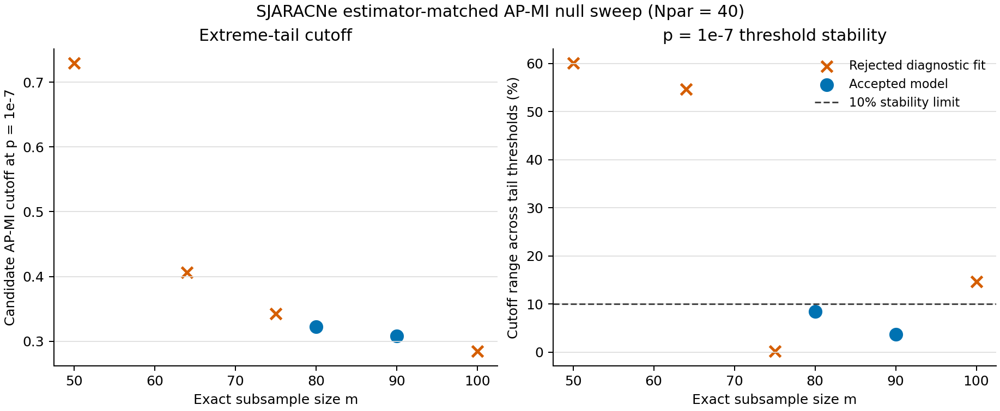

# Estimator-matched AP-MI null calibration

This directory records the first fail-closed calibration of SJARACNe's exact
adaptive-partitioning MI (AP-MI) estimator. Biological expression data are not
used to fit this independence null. For each exact observation count `m`, the
C++ generator evaluates

\[
\widehat I_b = \operatorname{APMI}_{\mathrm{SJARACNe}}
((1,\ldots,m),\pi_b(1,\ldots,m)),
\]

where each `pi_b` is a uniform random permutation. The generator and network
inference executable call the same extracted C++ kernel, so estimator changes
cannot silently diverge between calibration and inference.

## Calibration and acceptance rule

The recorded sweep used `Npar=40`, 5,000,000 fit draws, and a separate
5,000,000-draw validation stream for each `m` in 50, 64, 75, 80, 90, and 100.
A generalized Pareto distribution (GPD) is fit to strict exceedances above the
99.5th percentile. A model is emitted only when both checks pass:

1. its cutoff at the workflow default `p=1e-7` varies by no more than 10% across
   fits at tail thresholds q=0.9925, 0.995, and 0.9975; and
2. its nominal tail probabilities pass simultaneous 99% Clopper-Pearson checks
   on the independent validation stream at directly resolvable probabilities.

The sweep is intentionally fail-closed. Only `m=80` and `m=90` passed. The
other fitted parameters remain diagnostic results and are not runtime models.
No interpolation between `m` values is allowed.



| m | Candidate cutoff at 1e-7 | Stability range | Validation | Result |
|---:|---:|---:|:---:|:---:|
| 50 | 0.729445 | 60.07% | fail | rejected |
| 64 | 0.406153 | 54.70% | fail | rejected |
| 75 | 0.342265 | 0.13% | fail | rejected |
| 80 | 0.322465 | 8.44% | pass | accepted |
| 90 | 0.307902 | 3.71% | pass | accepted |
| 100 | 0.284274 | 14.70% | fail | rejected |

The compact results are in
[`calibration_summary.csv`](calibration_results_2026-08-12/calibration_summary.csv)
and [`rejection_diagnostics.csv`](calibration_results_2026-08-12/rejection_diagnostics.csv).
The complete machine-readable fit, validation, acceptance, seed, and raw-stream
provenance is preserved in
[`calibration_report.json`](calibration_results_2026-08-12/calibration_report.json).
The accepted, provenance-complete models are packaged in
`SJARACNe/config/apmi_null/`.

## BRCA100 held-out validation

BRCA100 is validation data, not fitting data. The primary check draws 100,000
independent gene-pair/permutation nulls at `m=80`, `Npar=40` and compares them
with 100,000 canonical rank-permutation nulls. The distributions agree closely:

- KS distance 0.00265 (descriptive p=0.873);
- mean AP-MI 0.009364 for BRCA versus 0.009174 for the canonical null;
- all checked nominal probabilities from 0.002 through 0.0002 lie within the
  pointwise 95% intervals for both streams.

See [the BRCA validation report](brca100_validation_README.md) and its plots.
This validates the rank-permutation construction at resolvable tail levels. It
does **not** validate `p=1e-7`: with 100,000 BRCA draws the direct floor is
`2e-4`, and even the 5,000,000-draw synthetic validation reaches only `2e-5`
under the predeclared expected-count rule. The default cutoff remains an
extreme-tail extrapolation, and SJARACNe says so at runtime and in output
headers.

## Build and calibrate

A normal build creates both binaries:

```bash
make -C SJARACNe
```

For an exact small null, the generator can enumerate every permutation:

```bash
SJARACNe/bin/apmi_null_generator.exe --m 8 --enumerate \
  --npar 40 --format tsv --output m8.tsv
```

For a production calibration sweep, use the installed console command or the
source module:

```bash
sjaracne-calibrate-apmi-null \
  --generator SJARACNe/bin/apmi_null_generator.exe \
  --output-dir calibration \
  --m 50 64 75 80 90 100 --npar 40

python -m SJARACNe.calibrate_apmi_null \
  --generator SJARACNe/bin/apmi_null_generator.exe \
  --output-dir calibration \
  --m 50 64 75 80 90 100 --npar 40
```

By default, any rejected `m` makes the sweep exit nonzero. For a diagnostic
multi-`m` sweep, `--allow-rejected-calibration` permits exit zero but still does
not emit rejected models. Raw float64 simulation streams are large and should
not be committed; their SHA-256 values and generator provenance are recorded.

## Use a model

The model must match the run's exact `m`, `Npar`, kernel schema, and ranking
policy. The native executable uses `-M`; the Python wrapper uses the same short
option or `--apmi-null-model`:

```bash
SJARACNe/bin/sjaracne.exe -i expression.exp -s hubs.txt -u 80 \
  -N 40 -p 1e-7 \
  -M SJARACNe/config/apmi_null/apmi_null_m00080_npar040.model \
  -o network.adj
```

An explicit `-t` cutoff still takes precedence. Supplying a model with legacy
with-replacement `-r` or adjacency replay `-j` is rejected because that null is
not the independent unique-rank null modeled here. Without `-M`, the old affine
ARACNe calibration remains available for backward compatibility and emits an
explicit warning.

## Limits

- The model is keyed to exact `m`, `Npar`, and the `sjaracne-apmi-v1` kernel.
- The canonical null assumes exchangeable observations and unique ordinal ranks.
  It is not valid for repeated/clustered samples without an appropriate blocked
  permutation design.
- BRCA100 has no within-gene exact ties. Heavy-tie and zero-inflated single-cell
  data need separate validation of the ranking/tie policy.
- The GPD cutoff at `1e-7` is extrapolated. The stability screen is evidence
  against gross threshold sensitivity, not direct Type-I validation at `1e-7`.
- A rejected size is a real result. Do not relax tolerances or interpolate just
  to manufacture a cutoff.
