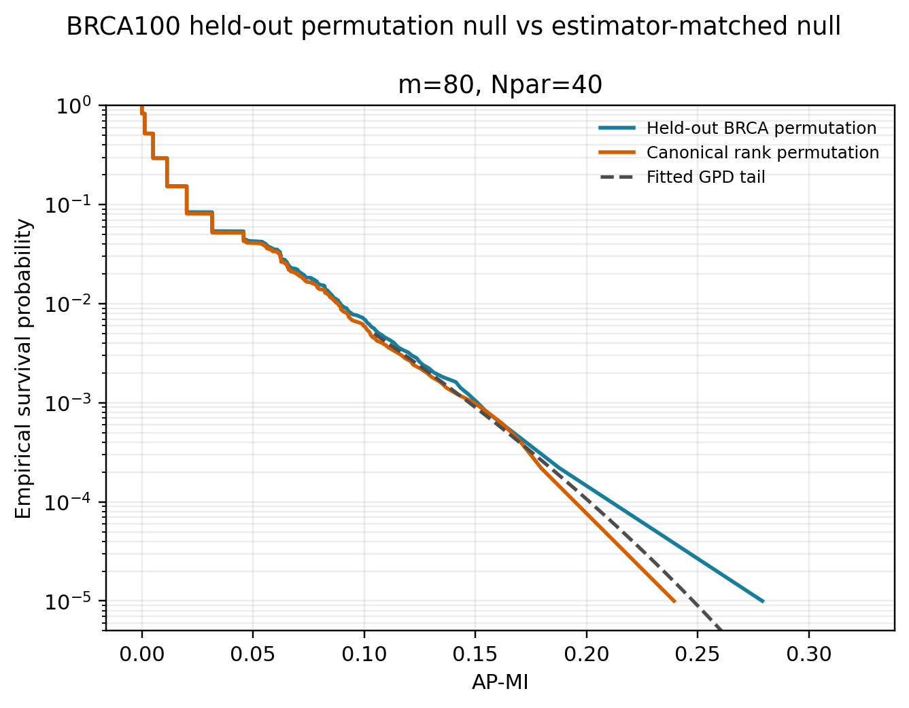
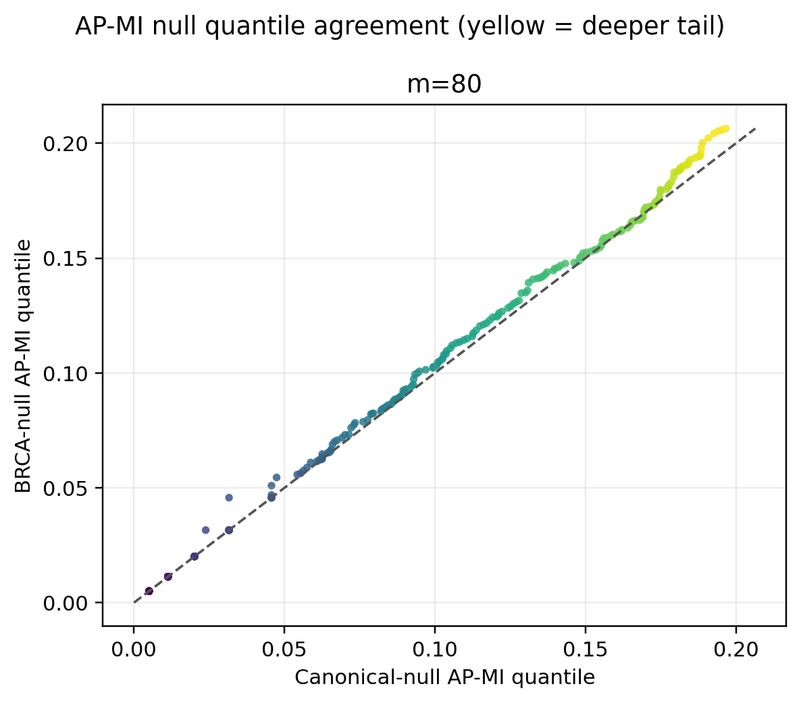
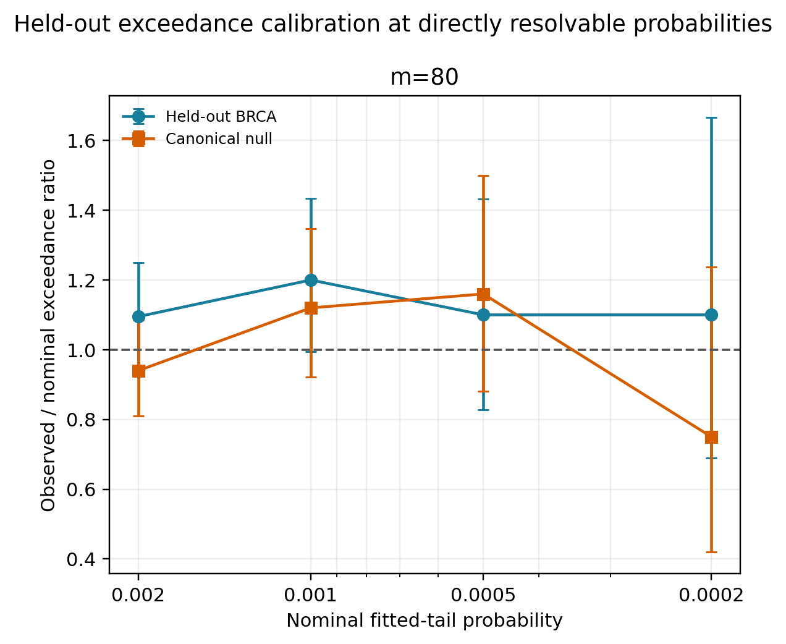

# Held-out BRCA100 AP-MI null validation

This validation checks whether the estimator-matched synthetic rank null and
its fitted tail describe independently permuted BRCA100 gene pairs. BRCA100 is
held out: no BRCA value is used to fit or select the null model.

## Design

For every draw, `brca100_validation_generator.cpp`:

1. uniformly selects two distinct nonconstant BRCA100 rows without exact ties;
2. selects `m` observations without replacement;
3. randomly permutes gene Y within that same selected subset, preserving both
   selected marginal expression distributions while removing pair alignment;
4. constructs unique ordinal ranks with the production `BuildRankCache`
   ordering rule (expression value, then selected position); and
5. calls `computeAdaptivePartitionMI` from the same `apmi.cpp` linked into the
   SJARACNe network executable and the canonical null generator.

The comparison distribution is generated independently by
`apmi_null_generator.exe`, using identity ranks paired with a uniform random
rank permutation. For continuous tie-free data these two nulls are
distributionally identical after ranking. Thus BRCA100 checks the full
expression-selection, permutation, ranking, and AP-MI path without turning a
biological dataset into calibration data.

The checked BRCA100 input contains 28,278 rows and 100 observations. All 28,278
rows are nonconstant and have no exact ties, so none were excluded.

## Primary result

The committed result uses `m=80`, `Npar=40`, 100,000 held-out BRCA draws and
100,000 independent canonical-null draws. Deterministic seeds are 20260820 for
BRCA and `20260821 + m` for the canonical null.

The null-generator executable used for this final validation has the same
SHA-256 recorded by the accepted calibration model. The validator checks this
before running, and the committed report records
`generator_match.status=executable-sha256-match`. A separate 10,000-draw prefix
comparison was used while developing the validator after an intermediate
rebuild, but it is not part of the final committed run or its evidence claims.

| Metric | Result |
|---|---:|
| Two-sample KS distance | 0.00265 |
| KS p-value (descriptive) | 0.8730 |
| BRCA mean AP-MI | 0.009364 |
| Canonical-null mean AP-MI | 0.009174 |
| Relative mean difference | +2.07% |
| Largest absolute difference among q50, q90, q95, q97.5, q99, q99.5, q99.9 | 0.003985 |

At the fitted model cutoffs, the point estimates were:

| Nominal p | Cutoff | BRCA observed p | Canonical observed p |
|---:|---:|---:|---:|
| 0.0020 | 0.129385 | 0.00219 | 0.00188 |
| 0.0010 | 0.147322 | 0.00120 | 0.00112 |
| 0.0005 | 0.164467 | 0.00055 | 0.00058 |
| 0.0002 | 0.185973 | 0.00022 | 0.00015 |

Each nominal probability lies inside the corresponding individual 95%
Clopper-Pearson interval for both distributions. These are pointwise,
descriptive intervals, not a family-wise acceptance test. Agreement between
BRCA and the canonical null is also more important here than forcing every
finite-simulation point estimate to equal its nominal probability.







## Reproduction

From the repository root under WSL, compile the held-out generator:

```bash
g++ -O3 -std=c++11 -Wall -Wextra -pedantic \
  -ISJARACNe/src \
  benchmarks/apmi_null_calibration/brca100_validation_generator.cpp \
  SJARACNe/src/apmi.cpp \
  -o benchmarks/apmi_null_calibration/brca100_validation_generator.exe
```

Then run the Python orchestrator from Windows (it translates executable and
data paths to WSL automatically) after creating the accepted exact-m models:

```powershell
python benchmarks\apmi_null_calibration\brca100_validation.py `
  --brca-generator benchmarks\apmi_null_calibration\brca100_validation_generator.exe `
  --synthetic-generator SJARACNe\bin\apmi_null_generator.exe `
  --model-dir <calibration-output-directory> `
  --calibration-raw-dir <calibration-output-directory>\raw `
  --output-dir benchmarks\apmi_null_calibration\brca100_validation_results_2026-08-12 `
  --m 80 --npar 40 --draws 100000 --execution wsl
```

On Linux, use `--execution native`. Multiple exact `m` values are supported,
but the script requires the calibration report to mark every requested model
as accepted unless `--allow-unaccepted-model` is explicitly supplied. Raw
float64 draws are reproducible but intentionally ignored by Git; the JSON
report records their SHA-256 hashes and all generator/model provenance.
When an executable hash differs from the calibration provenance and calibration
raw values are available, the script also requires an exact original-seed
stream-prefix match; any numerical drift is a hard error.

## Limits

- With 100,000 draws and the predeclared minimum of 20 expected exceedances,
  direct cutoff checks stop at `p=2e-4`.
- The default `p=1e-7` cutoff is an extreme-tail extrapolation. This BRCA100 run
  does not and cannot directly validate it; roughly 100 million draws would be
  needed even to expect only ten exceedances at that probability.
- The experiment validates the independence-null implementation and tail fit
  at resolvable probabilities. It does not establish biological false-positive
  control for dependent genes, nor does one dataset establish generality.
- Tied/discrete expression requires a separately specified jitter/tie policy.
  This validation intentionally uses only tie-free rows because the calibrated
  model declares `rank_policy=unique-ordinal-ranks`.

## Files

- `brca100_validation.py`: deterministic orchestration, validation metrics,
  provenance checks, CSV/JSON output, and PNG/SVG plotting.
- `brca100_validation_generator.cpp`: BRCA parser, subset/permutation/ranking
  path, and direct call to the shared C++ AP-MI kernel.
- `brca100_validation_results_2026-08-12/validation_report.json`: full inputs,
  hashes, seeds, model metadata, and limitations.
- `distribution_summary.csv`, `quantile_comparison.csv`,
  `model_exceedance.csv`, and `comparison_summary.csv`: machine-readable
  results.
