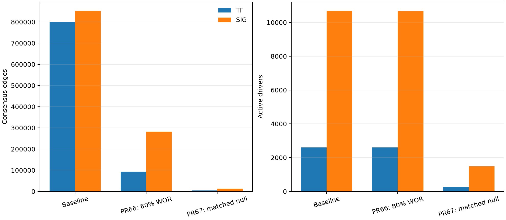
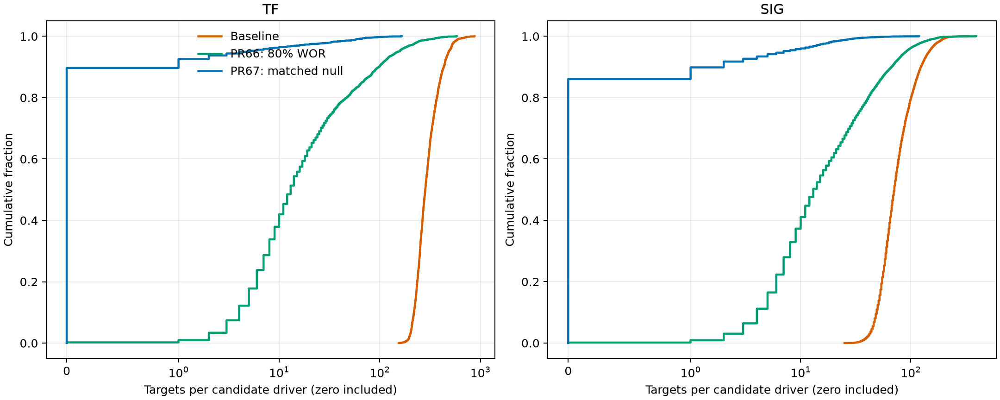
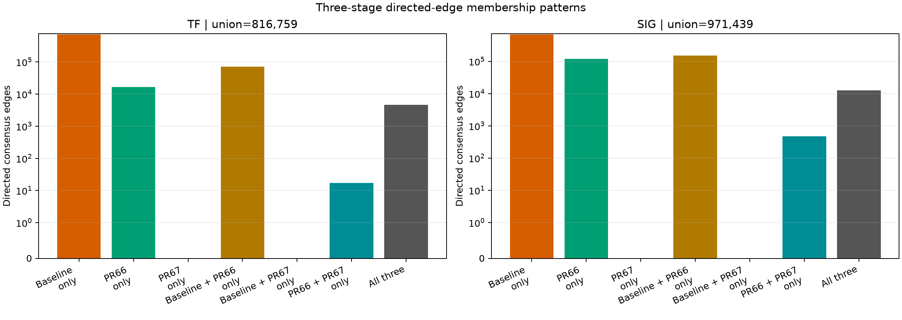
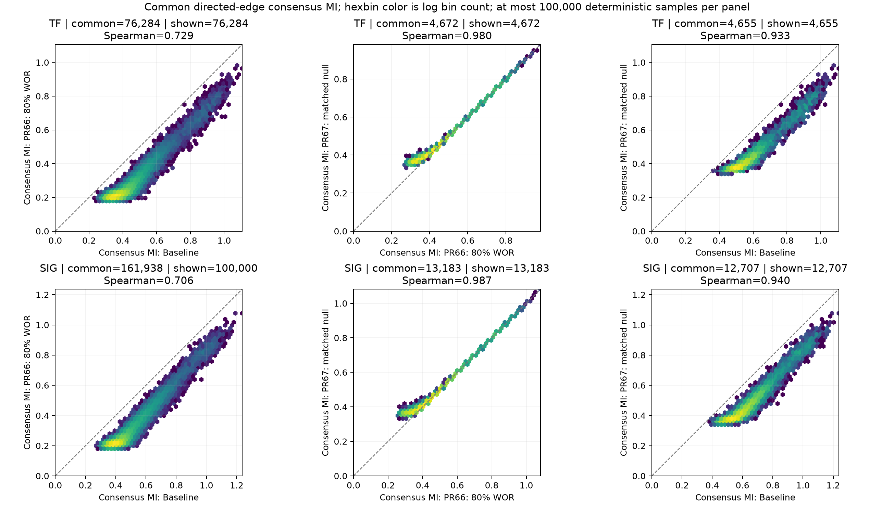
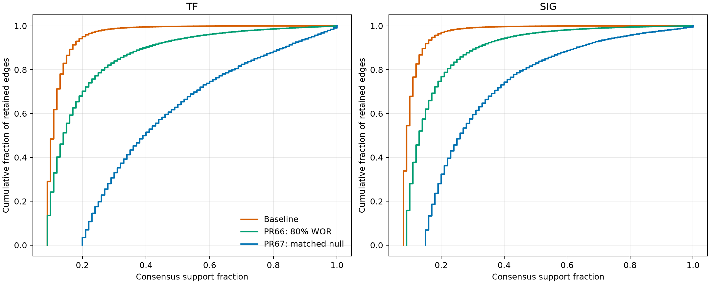
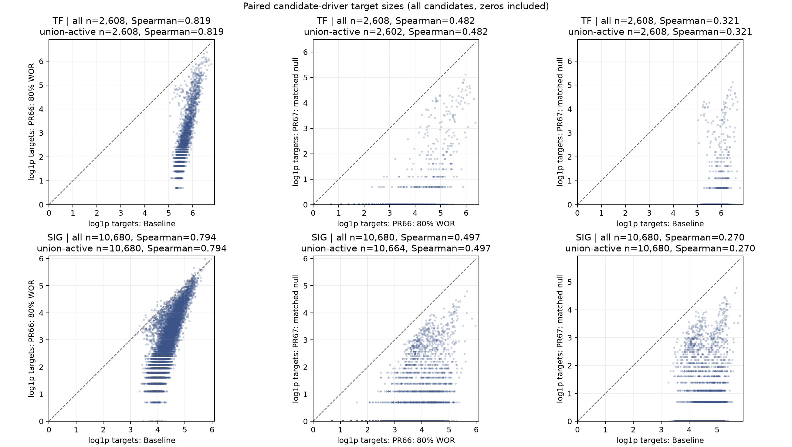

# BRCA100 matched-workflow results

## Design

The benchmark used the same `BRCA100.exp` matrix (28,278 genes by 100 samples), driver lists (2,608 TFs and 10,680 signaling genes), compiler, 100 seeds, adaptive-partitioning MI, `p=1e-7`, `Npar=40`, DPI epsilon 0, and consensus `p=1e-5` for all three stages. This produced 600 seed-level inference runs and six consensus networks.

| Stage | Commit | Sampling and MI cutoff |
|---|---|---|
| Baseline | `12113fbc80d753d945598ffc2c7d9e45787bc8e0` | Legacy N-out-of-N sampling with replacement; affine cutoff 0.153257 |
| PR66 | `58091832848b2eaf2ae08f6f69482357b6b9b72c` | Fixed `m=80` sampling without replacement; affine cutoff 0.172803 |
| PR67 | `7633ebb4a0d966dbda15a4e32d0efa492fb71aeb` | Same fixed `m=80` sampling; estimator-matched `m=80`, `Npar=40` AP-MI GPD-tail model; cutoff 0.322465 |

NetBID2 2.2.0 at commit `5defa454d600b94f5dd6d1f9f4428f99759a6821`, under R 4.4.3, imported each consensus as a directed, unweighted network and generated its network-QC report. Target-size summaries below include zero-target candidate drivers unless explicitly labeled active.

## Consensus topology and NetBID2 QC

| Drivers | Stage | Active / candidate drivers | Edges | Incident nodes | Weak components | Largest component | Median targets, all / active | Median MI | Median support | Scale-free adjusted R2 |
|---|---|---:|---:|---:|---:|---:|---:|---:|---:|---:|
| TF | Baseline | 2,608 / 2,608 | 800,099 | 28,278 | 1 | 28,278 | 283 / 283 | 0.3361 | 0.11 | 0.262 |
| TF | PR66 | 2,602 / 2,608 | 92,944 | 21,270 | 19 | 21,222 | 13 / 13 | 0.2136 | 0.14 | 0.850 |
| TF | PR67 | 269 / 2,608 | 4,672 | 1,719 | 63 | 1,328 | 0 / 4 | 0.4182 | 0.40 | 0.737 |
| SIG | Baseline | 10,680 / 10,680 | 851,887 | 28,278 | 1 | 28,278 | 71 / 71 | 0.3826 | 0.09 | 0.455 |
| SIG | PR66 | 10,664 / 10,680 | 281,490 | 27,652 | 4 | 27,646 | 13 / 13 | 0.2129 | 0.13 | 0.932 |
| SIG | PR67 | 1,488 / 10,680 | 13,183 | 3,270 | 215 | 2,692 | 0 / 4 | 0.4301 | 0.26 | 0.932 |

PR66 reduced the TF and SIG consensus edge counts by 88.4% and 67.0%, respectively, while retaining nearly every candidate driver as active. Its zero-filled median target size was 13 in both networks, versus 283 TF and 71 SIG at baseline. The NetBID2 scale-free-fit statistic rose from 0.262 to 0.850 for TF and from 0.455 to 0.932 for SIG.

PR67 was much more stringent: relative to PR66 it removed 95.0% of TF edges and 95.3% of SIG edges. Only 10.3% of TF candidates and 13.9% of SIG candidates remained active, and both graphs split into many components. The retained edges had higher median MI and support, but the resulting loss of driver coverage and connectivity is material; it is not captured by the scale-free-fit statistic alone.

## Cross-stage agreement

Correlations are reported as Pearson / Spearman. Target-size correlations use all candidate drivers, including zero-target drivers; MI and support correlations use only directed edges shared by the pair.

| Drivers | Pair | Shared edges | Edge Jaccard | Target-size correlation | Common-edge MI correlation | Common-edge support correlation |
|---|---|---:|---:|---:|---:|---:|
| TF | Baseline vs PR66 | 76,284 | 0.0934 | 0.777 / 0.819 | 0.926 / 0.729 | 0.729 / 0.497 |
| TF | PR66 vs PR67 | 4,672 | 0.0503 | 0.657 / 0.482 | 0.992 / 0.980 | 0.748 / 0.719 |
| TF | Baseline vs PR67 | 4,655 | 0.00582 | 0.308 / 0.321 | 0.968 / 0.933 | 0.731 / 0.664 |
| SIG | Baseline vs PR66 | 161,938 | 0.1667 | 0.862 / 0.794 | 0.940 / 0.706 | 0.663 / 0.429 |
| SIG | PR66 vs PR67 | 13,183 | 0.0468 | 0.512 / 0.497 | 0.991 / 0.987 | 0.751 / 0.742 |
| SIG | Baseline vs PR67 | 12,707 | 0.0149 | 0.300 / 0.270 | 0.963 / 0.940 | 0.724 / 0.591 |

Every PR67 consensus edge was also present in PR66. Of the PR67 edges, 4,655 TF and 12,707 SIG edges were shared by all three stages; the remaining 17 TF and 476 SIG edges were shared only by PR66 and PR67. The approximately 0.99 Pearson and 0.98 to 0.99 Spearman MI correlations between PR66 and PR67 show that retained-edge MI values remain strongly concordant and their ordering is largely preserved. The large topology difference is therefore primarily stringent selection from the PR66 network, not a major reordering of common-edge MI.

Baseline versus PR66 is not a one-variable comparison: both the resampling scheme and the affine cutoff's effective sample size changed. PR66 versus PR67 is the cleaner comparison for the effect of the estimator-matched threshold because both use the same fixed `m=80` samples without replacement.

## Execution diagnostics

The following seed-level values are medians across 100 runs per arm. Peak RSS is shown as median (maximum).

| Drivers | Stage | Edges/run | User time (s) | Elapsed time (s) | Peak RSS MiB | Adjacency MiB |
|---|---|---:|---:|---:|---:|---:|
| TF | Baseline | 989,134 | 136.52 | 136.90 | 323.6 (662.5) | 20.68 |
| TF | PR66 | 57,477 | 78.89 | 78.98 | 66.6 (66.9) | 1.23 |
| TF | PR67 | 3,316 | 82.20 | 82.25 | 65.6 (65.8) | 0.08 |
| SIG | Baseline | 1,794,046 | 649.20 | 650.33 | 905.8 (1,992.7) | 37.58 |
| SIG | PR66 | 202,556 | 319.35 | 319.54 | 73.5 (74.3) | 4.36 |
| SIG | PR67 | 8,155 | 333.90 | 333.93 | 66.3 (66.5) | 0.19 |

Inference used a mixed 12-process workload. These elapsed times are execution diagnostics, not a controlled runtime benchmark, and the stages emit radically different numbers of edges. They must not be treated as isolated implementation speedups.

Consensus construction was serialized because it retains the union of seed-level edges in memory:

| Drivers | Stage | Elapsed (s) | Peak RSS (GiB) |
|---|---|---:|---:|
| TF | Baseline | 1,179.35 | 9.838 |
| TF | PR66 | 120.95 | 0.701 |
| TF | PR67 | 12.86 | 0.175 |
| SIG | Baseline | 1,498.98 | 27.650 |
| SIG | PR66 | 367.12 | 2.458 |
| SIG | PR67 | 22.45 | 0.197 |

The consensus RSS reductions track much smaller seed-level edge unions and outputs; they do not isolate a consensus-algorithm optimization.

## Interpretation and calibration limitation

PR66 yields much sparser BRCA100 consensus networks while preserving broad driver coverage and improving the reported scale-free-fit statistic. PR67 selects a small, high-MI, high-support subset of PR66, but at the cost of sharply reduced driver coverage and fragmented topology.

At the retained default `p=1e-7`, PR67's cutoff is a GPD-tail extrapolation below the range independently validated during calibration (`p>=2e-5`). These results verify a completed, hash-validated matched execution and describe the topology produced by that extrapolated cutoff; they do **not** establish that `p=1e-7` is calibrated.

Finally, NetBID2 QC, scale-free fit, edge overlap, MI agreement, and support are descriptive diagnostics. BRCA100 supplies no network ground truth here, so none of these measurements proves that one stage is biologically more accurate. Biological validation or a suitable truth-labeled simulation would be required for that conclusion.

## Reproducibility artifacts

The compact tracked package contains the [machine-readable comparison tables](comparison/), both PNG and SVG figures, the [600-run manifest](provenance/run_manifest.tsv), exact build and downstream manifests, consensus parameter summaries, and phase timing records. `SHA256SUMS` authenticates every packaged artifact except itself.

The raw 600 adjacencies, six full consensus/support tables, edge-level metric tables, and six self-contained NetBID2 HTML reports remain in the persistent WSL work area rather than Git. Their hashes are recorded in the packaged manifests and [comparison-output hash record](provenance/comparison_output_hashes.txt). A hardened resume revalidated all 600 adjacency hashes without recomputation.

One metadata field needs care: the historical top-level `workers` value in `run_metadata.json` is 8 from the build invocation. The authoritative inference fields and completed invocation record show 12 workers. That invocation records the final 600-resumed, zero-new validation pass; seed timestamps and logs document the original generation run.
