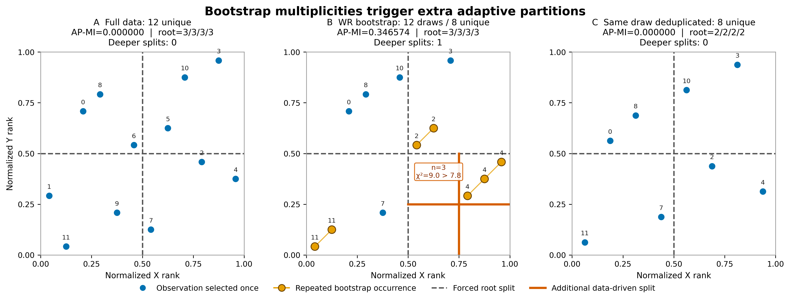
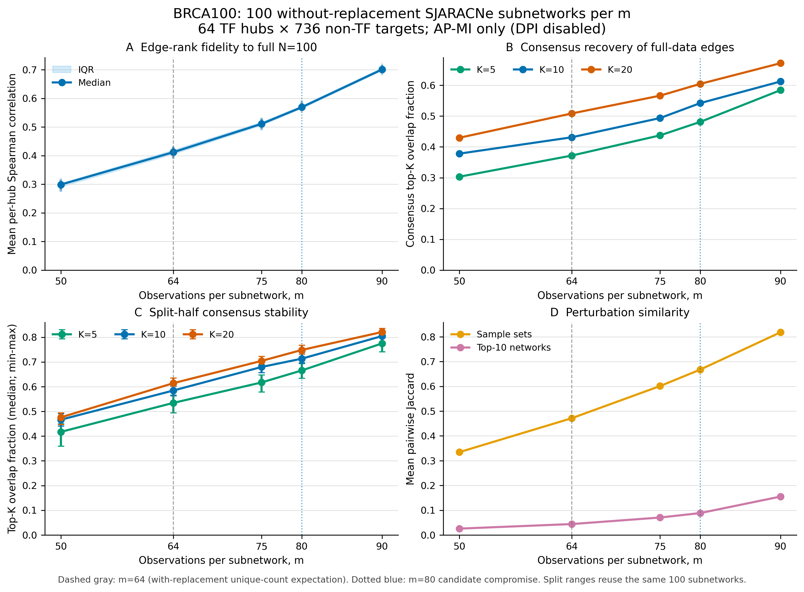
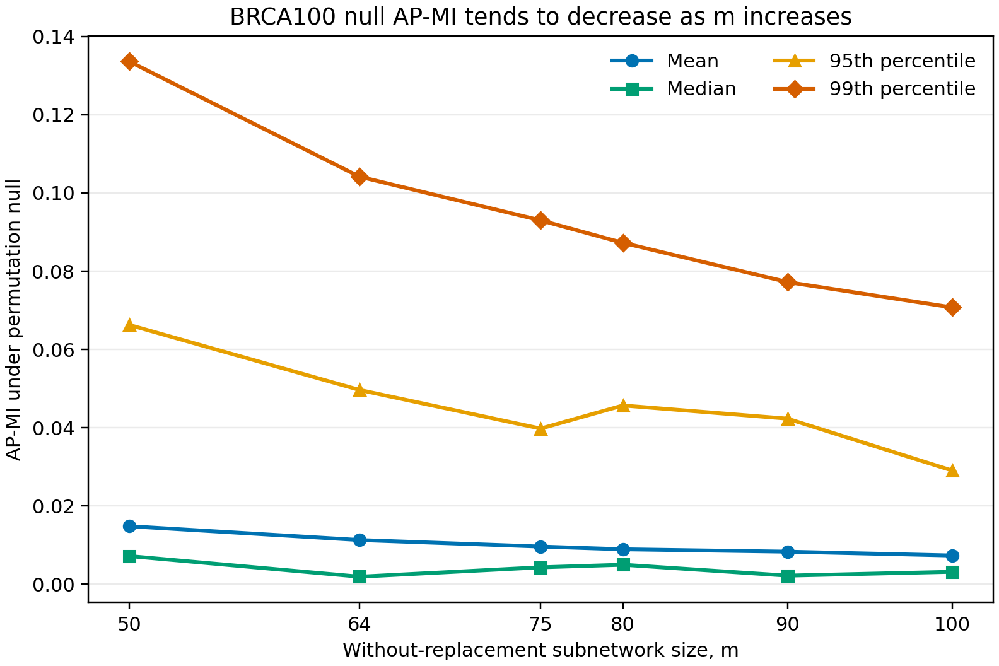

# Fixed-size sampling without replacement

This directory records the evidence used to replace the standard SJARACNe
`N`-out-of-`N` bootstrap with fixed-size subsampling without replacement. The
default is 80% of the eligible observations. This is a pragmatic SJARACNe
default, not a claim that 80% is universally optimal.

## Why bootstrap duplicates can distort AP-MI

An `N`-draw bootstrap samples with replacement. Its expected number of unique
observations is

```text
N * (1 - (1 - 1/N)^N),
```

which is 63.397 when `N=100` and tends to `(1 - 1/e)N` as `N` grows. The
remaining draws are repeated joint observations. Because adaptive-partition MI
(AP-MI) tests local point densities, assigning integer weight greater than one
to a joint observation can create an artificial high-density region and can
trigger partitions that the unique observations do not support.

### Exact small example

The deterministic `N=12` example uses:

```text
index:       0  1  2  3  4  5  6  7  8  9 10 11
x:           2  0  9 10 11  7  5  6  3  4  8  1
y:           8  3  5 11  4  7  6  1  9  2 10  0
bootstrap:   2  7 11 11 10  8  4  4  0  2  3  4
```

The bootstrap has 12 draws but only 8 unique observations. Observation 4 is
drawn three times. All three occurrences therefore have exactly the same raw
`x` and `y` values. Ranking gives the tied copies adjacent ordinal ranks, but
does not turn them into independent observations.

| Input to AP-MI | Observations | AP-MI | Additional data-driven splits |
|---|---:|---:|---:|
| Full data | 12 unique | 0 | 0 |
| Bootstrap with replacement | 12 draws / 8 unique | 0.3465735903 | 1 |
| Same bootstrap, duplicates collapsed | 8 unique | 0 | 0 |

In the with-replacement panel, the triplicated joint point makes one child
partition contain three coherent copies. Its local chi-square statistic is 9,
which exceeds SJARACNe's split threshold of 7.8. Collapsing the duplicates
removes that split and the estimated MI returns to zero.



This example demonstrates possibility, not inevitability: duplicate points can
raise or lower an individual estimate depending on where they land relative to
partition boundaries.

## BRCA100 duplicate experiment

The BRCA100 expression matrix contains 28,278 probes and 100 observations. A
deterministic panel check evaluated 160 genes, 12,720 pairs,
and 40 bootstrap seeds (508,800 pair-seed estimates). A legacy 100-draw
bootstrap contained a mean of 63.675 unique observations and 36.325 duplicate
occurrences. The results reproduced the same pattern:

| Data | Legacy with replacement | Same-draw deduplicated | Independent `m=63` without replacement |
|---|---:|---:|---:|
| Real BRCA panel, mean AP-MI | 0.05246 | 0.01420 | 0.01429 |
| Independently gene-permuted null, mean AP-MI | 0.04731 | 0.01152 | 0.01164 |

One low-dependence null example, FASTKD3-C14orf1 at seed 10, had full-data
Spearman 0.00965 and full-data AP-MI 0.000800. Its legacy bootstrap AP-MI was
0.518276. Independently ordering duplicate ties reduced it to a mean of
0.163428, but removing multiplicity reduced it much further: 0.007603 for the
deduplicated draw and 0.010281 for an independent `m=63` subsample. That draw
contained only 57 unique observations and had maximum multiplicity five.

### A striking observed BRCA100 edge

An exact SJARACNe run with hub `ILMN_1659885` (ACSS3), target `ILMN_1786852`
(ZCCHC3), and seed 20260811 produced:

| Run | Effective observations | AP-MI |
|---|---:|---:|
| Full data | 100 unique | 0.000800213 |
| Legacy bootstrap | 100 draws / 68 unique | 0.438501 |

This edge was selected because it is visually striking; it is not presented as
a typical fold change. Across the full one-hub comparison, the mean MI rose
from 0.00823 to 0.03165 and 60.8% of the 28,277 hub-target MIs increased.

## Relationship to ARACNe3 and the NaRnEA paper

[Section 2.2 of the NaRnEA paper](https://pmc.ncbi.nlm.nih.gov/articles/PMC10048242/#sec2dot2-entropy-25-00542)
describes ARACNe3's network-reconstruction method. It reports that replicated
bootstrap observations create high-density regions in the joint distribution,
increasing AP-MI bias, while stochastic changes in the replicated regions
increase between-network variance.

ARACNe3's solution is fixed-size subsampling without replacement at
`1 - 1/e`, approximately 63.21%. This matches the asymptotic unique-observation
fraction of an `N`-draw bootstrap while avoiding sampling-induced duplicate
observations. The
[official implementation](https://github.com/califano-lab/ARACNe3/blob/main/src/app/io.cpp#L38-L63)
subsamples distinct columns from the copula-transformed matrix and reranks each
selected gene row to ranks divided by `m+1` before AP-MI. Its
[documented default](https://github.com/califano-lab/ARACNe3/blob/main/README.md#L249-L250)
is 0.63212, and the
[implementation uses `ceil(fraction*N)`](https://github.com/califano-lab/ARACNe3/blob/main/src/app/ARACNe3.cpp#L174-L185).
Thus it selects 64 of 100 observations, not 80.

SJARACNe adopts ARACNe3's no-duplicate principle but uses a different default,
based on the sensitivity experiment below.

## Why the SJARACNe default is 80%

The BRCA100 size sweep used a deterministic panel of 64 TF hubs and 736 non-TF
targets (47,104 scored pairs), 100 independently sampled subnetworks per size,
`Npar=20`, MI threshold zero, and DPI disabled. For a given replicate, sizes
`m=50,64,75,80,90` were nested prefixes of one permutation, making comparisons
paired. The full `N=100` AP-MI matrix was the reference. The run used ancestor
commit `f79cfda`; the AP-MI kernel is unchanged by this sampling-method branch.

Primary top-10-per-hub results were:

| m | Per-hub edge-rank correlation to full | Mean per-run recovery | Consensus recovery | Split-half consensus overlap | Mean sample-set Jaccard |
|---:|---:|---:|---:|---:|---:|
| 50 | 0.297 | 0.099 | 0.378 | 0.466 | 0.334 |
| 64 | 0.412 | 0.150 | 0.431 | 0.584 | 0.471 |
| 75 | 0.512 | 0.209 | 0.494 | 0.680 | 0.601 |
| 80 | 0.570 | 0.249 | 0.542 | 0.713 | 0.668 |
| 90 | 0.702 | 0.358 | 0.613 | 0.805 | 0.818 |



Every fidelity and stability metric improved as `m` increased; the curves did
not plateau by 90. Therefore 80 is not an empirical optimum. It is a compromise:

- `m=64` preserves strong perturbation but recovers fewer full-data top edges.
- `m=90` has better fidelity, but two subsets share about 81 observations and
  differ by only about 9 observations on each side, so the ensemble is weakly
  perturbed.
- `m=80` omits 20 observations; two subsets share about 64 and differ by about
  16 observations on each side. It improves recovery over 64 while retaining
  appreciably more perturbation diversity than 90.

A separate 10,000-trial paired permutation-null sweep showed that mean null
AP-MI and q99 generally decreased as `m` grew, while q95 fluctuated:

| m | Mean null AP-MI | q95 | q99 |
|---:|---:|---:|---:|
| 50 | 0.01485 | 0.06628 | 0.13361 |
| 64 | 0.01132 | 0.04966 | 0.10415 |
| 75 | 0.00965 | 0.03980 | 0.09299 |
| 80 | 0.00895 | 0.04570 | 0.08725 |
| 90 | 0.00834 | 0.04233 | 0.07722 |
| 100 | 0.00737 | 0.02908 | 0.07075 |



For BRCA100, the recommendation is `m=80` as the primary setting, with `m=64`
and `m=90` sensitivity analyses. The workflow generalizes this as
`m=ceil(0.8*N_eligible)`, not as a fixed count of 80. Important analyses should
still verify that conclusions are stable to the sampling fraction.

## Included results

- `brca100_subsample_size_summary.csv`: aggregate recovery/stability metrics.
- `brca100_subsample_per_run_metrics.csv`: the 500 individual subnetwork metrics.
- `brca100_subsample_size_results.json`: design and provenance for the size sweep.
- `brca100_null_apmi_summary.csv`: aggregate paired permutation-null metrics.
- `brca100_null_apmi_results.json`: design and provenance for the null sweep.
- `brca100_duplicate_real_summary.json` and
  `brca100_duplicate_permuted_null_summary.json`: the 508,800-pair BRCA checks.

The full 4.1 MB trial-level null table is intentionally not tracked. All figures
show descriptive sensitivity analyses, not formal proof that 80% is optimal for
every expression dataset. The larger duplicate-panel summaries record the
executable path and exact agreement with materialized matrices for seeds 1-5,
but predate binary-hash metadata; they should not be attributed to a more
specific build than the checked results state.
